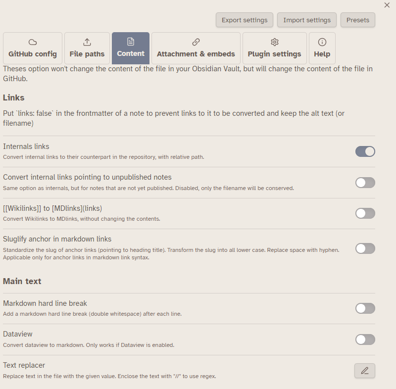

> [!note] These settings won't change the content of your files in your vault. They only affect the files that are being uploaded to the remote repository, and how they are organized and deleted within that repository.

## Links

These options can help you to ensure that the links in your shared files are valid and point to the correct location in your remote repository.

The internal links option will convert links to match the relative path in your repository, while the wikilinks to markdown link option will convert wikilinks to the standard markdown link format.

This can be especially useful if your publishing solution does not support wikilinks, or if you want to ensure that your links are consistent across different platforms.

### Internal links

This option will convert the internal links (including attachments links!) of the shared file to match the relative file in your repository. Only **existing**, **shared**, and from the **same repository** files will be converted.

The next option allows you to convert links to files that are not shared. This is useful if you already plan to share a file but haven't done so yet, without having to go over every mention!

### Wikilinks to Markdown link

In case you use wikilinks as a daily but your Obsidian publishing solution doesn't support it, you can use these settings to convert the wiki to MD link.

## Main text

For some reasons, you may need to convert text in your file. Here you can configure to:

- Use "hard break line" of the markdown specification, also known as adding two spaces at the end of each line.
- Convert dataview queries to markdown. If this option is disabled, dataview queries will be removed entirely in the converted file.
- Text replacement: you can replace text with another one in the converted file, using a simple string or regex.
  - The replacement can be empty to remove the whole string.
  - You can set custom regex flags to arrange your regex. See [here for information about JS regex flags](https://javascript.info/regexp-introduction#flags)
  - You can also set the moment where the regex is run : the replacement can be executed BEFORE all other conversion or AFTER (ie Dataview, tags…).

## Tags

This part allows pulling some contents to add them into your frontmatter `tags` field.

- <u>Inline Tags: </u> Add your inline tags into your frontmatter and convert nested tags by replacing the `/` with `_` (for example, `#tag/subtag` will be converted to `tag_subtag`), also, consequently, fix your frontmatter as YAML standard.
- <u>Convert frontmatter/inline field into tags</u> : This will convert the value associated with the preconfigured field into frontmatter tags. You can also prevent some values from being converted with the second field.

> [!note] If the value is a **link**, the converted value will be the filename or the displayed name. You can either exclude the filename or the displayed name.

This option can be useful if you want to organize your files using tags in the frontmatter. It allows you to automatically add tags to your files based on the contents of the file, such as inline tags or specific fields.
